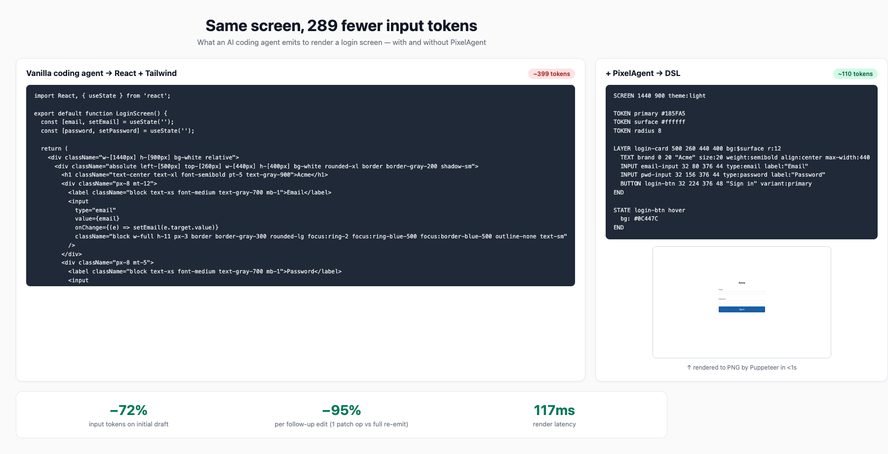

# PixelAgent

> **DSL preview middleware that cuts AI-coding-agent token cost by ~90% during UI iteration.**

Coding agents (Claude Code, Cursor, Aider) burn tokens by emitting full
React/HTML for every preview *and* every edit. PixelAgent inserts a
typed DSL between the agent and the bitmap: the agent emits ~110-token
DSL once, then ~30-token patch ops per edit. Same Chrome engine renders
the preview, so visuals match what you'd ship.



## Real numbers, real renders

The screenshots below are **actual PNG output** from the renderer in
this repo, captured by the `/preview` and `/apply-patch` HTTP endpoints
running locally. Token counts use the standard 4-chars-per-token rule.


| | Vanilla coding agent | + PixelAgent | Saving |
|---|---|---|---|
| Initial draft (1 screen) | React + Tailwind component, ~416 tokens | DSL, ~110 tokens | **−74%** |
| Single follow-up edit ("make Sign in red") | re-emit full component, ~416 tokens | 1 patch op, ~19 tokens | **−95%** |
| Multi-edit (rename + placeholder + remove) | ~416 tokens | 3 patch ops, ~46 tokens | **−89%** |
| **6-step session (1 draft + 5 edits)** | **~2,496 tokens** | **~260 tokens** | **−89.6%** |
| Render latency | n/a (no preview) | 700ms cold, ~100ms warm | — |

### Pixel-stable across edits

| Initial draft | After 1 op (`variant: destructive`) | After 3 ops (rename, placeholder, drop password) |
|:---:|:---:|:---:|
|  |  |  |
| `~110 tokens DSL` | `~19 tokens (1 op)` | `~46 tokens (3 ops)` |

Every unchanged element keeps its exact pixel position — no drift, no
"Claude rewrote the button radius from 6px to 8px again". That's the
hidden cost the table above doesn't capture.

---

## Try it locally

```bash
git clone git@github.com:junixlabs/PixelAgent.git
cd PixelAgent
npm install
npm run start --workspace=@pixelagent/api  # boots HTTP API on :3030
```

In another terminal, reproduce the demo above:

```bash
# Initial preview
curl -sX POST localhost:3030/preview \
  -H 'content-type: application/json' \
  -d "{\"dsl\":\"$(cat packages/dsl-spec/examples/login.dsl | jq -Rs . | sed 's/^"//;s/"$//')\"}" \
  | jq -r .png_base64 | base64 -d > preview.png

# 1-op edit — change Sign in variant to destructive
curl -sX POST localhost:3030/apply-patch \
  -H 'content-type: application/json' \
  -d '{"dsl":"...","ops":[{"op":"modify","id":"login-btn","field":"variant","value":"destructive"}]}' \
  | jq -r .png_base64 | base64 -d > patched.png
```

Or wire it into Claude Code as an MCP server (no API key needed) —
see [`docs/mcp-integration.md`](docs/mcp-integration.md).

## Status

- **Phase 1** — Parser, renderer, HTTP `/preview` + `/apply-patch` +
  `/patch`, MCP server (preview + apply_patch tools, grammar resource).
  87/88 tests passing, hardened against LLM-malformed input.
- **Phase 2** — Code synthesis (DSL → React / HTML / SwiftUI), CLI
  binary, GitHub Actions CI.
- **Phase 3** — Vision-verify, pixel-trace bidirectional, multi-target
  output.

## Problem (the long version)

Khi Claude Code, Cursor, hoặc bất kỳ coding agent nào build UI cho user, có 3 inefficiency lớn:

1. **Preview tốn tài nguyên.** Coding agent muốn show preview phải sinh full code (~3000 tokens, 25-40 giây). User reject = waste hết.
2. **Edit re-generate full code.** User nói "đổi nút xanh" → coding agent re-generate 100% component. 5 lần edit = 5× cost.
3. **Inconsistency micro-details.** Coding agent sinh 3 buttons với spacing khác, 2 cards với border-radius khác. User phải tự spot và báo từng cái.

---

## Solution Architecture

PixelAgent chạy 4 stage giữa coding agent và user:

```
Coding agent (Claude/GPT)
       │
       ▼
┌──────────────────────────────────────────────┐
│  Stage 1: DSL Generation                     │
│  Coding agent sinh DSL (~300 tokens)          │
│  thay vì code (~3000 tokens)                  │
└──────────────────┬───────────────────────────┘
                   │
                   ▼
┌──────────────────────────────────────────────┐
│  Stage 2: Render Bitmap (zero LLM cost)      │
│  DSL → HTML/CSS internal → Headless Chrome    │
│  → PNG bitmap (~3 giây)                       │
└──────────────────┬───────────────────────────┘
                   │
                   ▼
┌──────────────────────────────────────────────┐
│  Stage 3: Preview & Feedback                 │
│  User xem PNG → Approve / Reject / Edit      │
└──────────────────┬───────────────────────────┘
                   │
              Edit feedback
                   ▼
┌──────────────────────────────────────────────┐
│  Stage 3.5: Surgical DSL Patch (key)         │
│  Coding agent sinh patch (~30 tokens)         │
│  PATCH login-btn bg:#10B981                   │
│  Apply local, re-render. 100x rẻ hơn regen.   │
└──────────────────┬───────────────────────────┘
                   │
              User approves
                   ▼
┌──────────────────────────────────────────────┐
│  Stage 4: Final Code Synthesis               │
│  DSL final → React/HTML/SwiftUI              │
│  CHỈ CHẠY 1 LẦN, không phải N lần             │
└──────────────────────────────────────────────┘
```

### DSL example

```
SCREEN 1440 900 theme:light

TOKEN primary #185FA5
TOKEN surface #ffffff
TOKEN radius 8

LAYER login-card 500 260 440 400 bg:$surface r:12
  TEXT brand 0 20 "Acme" size:20 weight:semibold align:center max-width:440
  INPUT email-input 32 80 376 44 type:email label:"Email"
  INPUT pwd-input 32 156 376 44 type:password label:"Password"
  BUTTON login-btn 32 224 376 48 "Sign in" variant:primary
END

STATE login-btn hover
  bg: #0C447C
END
```

15 commands tổng cộng: SCREEN, TOKEN, FILL, RECT, TEXT, ICON, IMAGE, INPUT, BUTTON, LAYER, STACK, GRID, STATE, REPEAT, EFFECT.

---

## Repository Structure

```
pixelagent/
├── README.md                      # This file
├── package.json
├── tsconfig.json
│
├── packages/
│   ├── dsl-spec/                  # DSL specification & docs
│   │   ├── SPEC.md                # Full DSL v0 specification
│   │   ├── examples/              # Reference DSL files
│   │   └── grammar.ts             # Type definitions
│   │
│   ├── parser/                    # DSL parser (TypeScript)
│   │   ├── src/
│   │   │   ├── tokenizer.ts
│   │   │   ├── parser.ts
│   │   │   ├── validator.ts
│   │   │   └── types.ts
│   │   └── tests/
│   │
│   ├── renderer/                  # DSL → bitmap renderer
│   │   ├── src/
│   │   │   ├── dsl-to-html.ts     # DSL → HTML/CSS internal
│   │   │   ├── render.ts          # Headless Chrome → PNG
│   │   │   └── id-buffer.ts       # Pixel→element trace
│   │   └── tests/
│   │
│   ├── api/                       # HTTP/MCP API server
│   │   ├── src/
│   │   │   ├── server.ts          # Express/Fastify
│   │   │   ├── routes/
│   │   │   │   ├── preview.ts     # POST /preview
│   │   │   │   ├── patch.ts       # POST /patch
│   │   │   │   └── synthesize.ts  # POST /synthesize
│   │   │   └── mcp/               # MCP server wrapper
│   │   └── tests/
│   │
│   └── codegen/                   # DSL → React/HTML/SwiftUI
│       ├── src/
│       │   ├── react.ts
│       │   ├── html.ts
│       │   └── swiftui.ts
│       └── tests/
│
├── docs/                          # Public documentation
│   ├── getting-started.md
│   ├── dsl-reference.md
│   ├── mcp-integration.md
│   └── api-reference.md
│
└── examples/
    ├── claude-code-mcp/           # Demo MCP integration
    └── manual-cli/                # Demo CLI usage
```

---

## Implementation Roadmap

### Phase 1 — MVP Core (P0, 4-6 weeks)

**Goal:** End-to-end flow chạy được với 1 screen mẫu.

- [ ] **DSL Parser** (`packages/parser`)
  - Tokenizer: split commands, handle quoted strings
  - Parser: build scene tree, resolve TOKEN references
  - Validator: check SCREEN first line, block balance, ID uniqueness, child bounds
  - Output: typed AST (`Scene IR`)
- [ ] **Renderer** (`packages/renderer`)
  - DSL AST → HTML/CSS string
  - Headless Chrome (Puppeteer) → PNG bitmap
  - Target latency: <5s per render
  - Support: LAYER, STACK, GRID layout primitives
- [ ] **Preview API** (`packages/api`)
  - `POST /preview { dsl: string } → { png_base64, render_ms, errors[] }`
  - Stateless, single endpoint
- [ ] **Patch API**
  - `POST /patch { dsl, instruction } → { new_dsl, diff_png }`
  - Internally calls LLM to generate patch from instruction
  - Apply patch to AST, re-render

### Phase 2 — Production-ready (P1, weeks 5-10)

- [ ] **Consistency validator**
  - Detect: spacing rhythm, TOKEN coverage, hover state coverage
  - Output: warnings array với line numbers
- [ ] **Code synthesis** (`packages/codegen`)
  - DSL AST → React + Tailwind component
  - DSL AST → HTML/CSS standalone
  - Pixel-locked vs adaptive output mode
- [ ] **MCP server wrapper**
  - Wrap APIs into MCP server
  - Submit to Anthropic MCP marketplace
  - Document Cursor/Claude Code setup
- [ ] **Tests + benchmarks**
  - Visual regression: render → screenshot → diff
  - Token cost benchmark vs raw Claude Code

### Phase 3 — Differentiation (P2, weeks 10+)

- [ ] **Vision verify (optional)**
  - Post-render check via Claude vision
  - Detect alignment, color drift errors
  - Cost-gated: chỉ chạy khi user opt-in
- [ ] **Pixel-trace bidirectional**
  - ID buffer encode element ID trong alpha channel
  - Click pixel → return element ID + DSL line
- [ ] **Multi-target output**
  - SwiftUI generation (native iOS)
  - Jetpack Compose (Android)

---

## API Reference (Phase 1)

### `POST /preview`

Render DSL to PNG.

**Request:**
```json
{
  "dsl": "SCREEN 1440 900 theme:light\n...",
  "scale": 1.0
}
```

**Response:**
```json
{
  "png_base64": "iVBORw0KGgoAAAANS...",
  "render_ms": 2340,
  "errors": [],
  "warnings": [
    { "line": 12, "msg": "INPUT height 32px below 36px minimum" }
  ]
}
```

### `POST /patch`

Apply natural-language edit to existing DSL.

**Request:**
```json
{
  "dsl": "...existing DSL...",
  "instruction": "Đổi màu nút Sign in thành xanh"
}
```

**Response:**
```json
{
  "new_dsl": "...updated DSL...",
  "patch": [
    { "op": "modify", "id": "login-btn", "field": "bg", "value": "#10B981" }
  ],
  "diff_png_base64": "...",
  "tokens_used": 28
}
```

### `POST /synthesize`

Generate final code from approved DSL.

**Request:**
```json
{
  "dsl": "...final approved DSL...",
  "target": "react-tailwind",
  "mode": "adaptive"
}
```

**Response:**
```json
{
  "code": "export default function LoginScreen() { return (...); }",
  "files": [
    { "path": "components/LoginScreen.tsx", "content": "..." }
  ]
}
```

---

## DSL Specification (v0)

### 15 commands by category

**Setup**
- `SCREEN <w> <h> [theme:light|dark]` — viewport, must be first line
- `TOKEN <id> <value>` — design tokens, referenced as `$id`

**Paint**
- `FILL <x> <y> <w> <h> <color>` — solid color region, no ID
- `RECT <id> <x> <y> <w> <h> [bg:] [r:] [border:]` — rectangle with ID
- `TEXT <id> <x> <y> "<string>" [size:] [weight:] [color:] [align:] [max-width:]`
- `ICON <id> <x> <y> "<name>" [size:] [color:]`
- `IMAGE <id> <x> <y> <w> <h> <src> [fit:] [r:]`

**Components**
- `INPUT <id> <x> <y> <w> <h> [type:] [placeholder:] [label:] [state:]`
- `BUTTON <id> <x> <y> <w> <h> "<label>" [variant:] [state:]`

**Layout (block commands, end with END)**
- `LAYER <id> <x> <y> <w> <h> [bg:] [r:] [border:]` — group container
- `STACK <id> <x> <y> [direction:] [gap:] [align:]` — auto-layout flex
- `GRID <id> <x> <y> <w> [columns:] [gap:]` — column-based grid

**Meta**
- `STATE <target-id> <state-name>` — visual state override
- `REPEAT <id> <count> [direction:] [gap:]` — template loop
- `EFFECT <target-id> <type> [params]` — shadow, blur, overlay

### Critical rules

1. `SCREEN` MUST be the first non-comment line, exactly once.
2. Children inside `STACK` must NOT have x/y coordinates (auto-positioned).
3. `RECT` is paint-only, never has children. Use `LAYER` for containers.
4. All elements (except FILL) need unique IDs.
5. Block commands (LAYER/STACK/GRID/REPEAT/STATE) end with `END`.
6. Border on LAYER/RECT uses inline param: `border:1 #ccc`. Don't use `EFFECT border` for inline borders.
7. TEXT with `align:center` should use `x:0` and `max-width:` to define centering box.
8. INPUT with `label:` requires `y >= 20` for label clearance.
9. BUTTON/INPUT minimum height: 36px (tap target).

---

## Technical Decisions

### Decision 1: Headless Chrome as render engine
**Choice:** Use Puppeteer/Playwright instead of custom renderer.
**Why:** Browser engine is battle-tested, pixel-perfect, free. Code output also targets browser → preview matches production. Custom renderer = 6 months wasted on font hinting and anti-aliasing.

### Decision 2: DSL as API contract
**Choice:** Treat DSL spec as a public, stable API contract.
**Why:** Once published, breaking changes break user code. Spend extra time on spec correctness and extensibility upfront.

### Decision 3: Edit on AST, not bitmap
**Choice:** All edits modify DSL AST and re-render. Pixel-level click only resolves to element ID, then edits AST.
**Why:** Single source of truth. Enables undo/redo and code generation. Pixel edits would lose semantic meaning.

### Decision 4: Open-source DSL, proprietary service
**Choice:** Open-source DSL spec + parser. Keep renderer/API as paid service.
**Why:** Open spec → developer trust + adoption. Service → revenue stream. Pattern proven by Cursor, Vercel, Cloudflare.

### Decision 5: MCP-first distribution
**Choice:** Wrap PixelAgent as MCP server, submit to Anthropic marketplace.
**Why:** Built-in distribution to Claude Code users. Cursor and other agents adopting MCP. Position as infrastructure, not product.

---

## Risks & Mitigations

| Risk | Severity | Mitigation |
|---|---|---|
| Anthropic/OpenAI build native DSL preview | High | Open-source spec, become standard before they do |
| Coding agents struggle to learn DSL | High | Test with Sonnet 4 from week 1. If <80% accuracy, redesign DSL |
| Renderer fidelity gap (preview ≠ code output) | Medium | Use same Chrome engine for both. Document ±2px tolerance |
| Pricing model unclear (who pays?) | Medium | Free tier + enterprise SLA. Pattern from Vercel/Cloudflare |
| Vision verify too expensive | Low | Make P2/optional. MVP doesn't depend on it |

---

## Validation Plan (14 days before full build)

Don't build full product yet. Validate problem first.

### Week 1: Measure & Listen

- [ ] **Day 1-3: Self-track.** Use Claude Code/Cursor to build 5 different UIs. Measure: tokens/screen, time/iteration, full re-gens triggered by single micro-edit. Get real data.
- [ ] **Day 4-5: Talk to devs.** 5-10 30-min interviews with active Claude Code/Cursor users. Ask: "What frustrates you most when AI builds UI?" Record exact wording.

### Week 2: Build & Signal

- [ ] **Day 6-8: Smallest demo.** DSL parser + Puppeteer renderer + 1 endpoint `/preview`. Just a login form. Test 5 different prompts.
- [ ] **Day 9-10: MCP prototype.** Wrap demo as MCP server. Test with Claude Code. Verify Claude can produce valid DSL.
- [ ] **Day 11-12: Public signal.** Tweet thread + HN post: "I'm building [problem] for Claude Code users. Here's the prototype. Anyone else struggle with this?"
- [ ] **Day 13-14: Decide.** Based on day 1-3 data, day 4-5 sentiment, day 11-12 signal → Continue full build, Pivot, or Drop.

---

## Pitch Statement

**Don't say:**
- "AI design tool" — competing with Lovable/v0/Framer (saturated market)
- "First to verify visually" — already done by research papers and Emergent.sh
- "Save tokens" — confusing without context

**Do say:**
- "Middleware that cuts Claude Code token cost by 85% during UI iteration"
- "DSL preview layer for AI coding agents — preview before code, patch instead of regen"
- "MCP server that gives Claude Code visual draft mode"

---

## Quick Start (when implemented)

```bash
# Install
npm install -g @pixelagent/cli

# Run as MCP server (for Claude Code)
pixelagent mcp --port 3030

# Or use directly
pixelagent preview --input login.dsl --output preview.png

# Patch existing DSL
pixelagent patch \
  --dsl login.dsl \
  --instruction "make button green" \
  --output login.dsl

# Generate final code
pixelagent synthesize \
  --dsl login.dsl \
  --target react-tailwind \
  --output components/LoginScreen.tsx
```

---

## License

MIT for DSL spec, parser, examples.
Renderer service and hosted API: commercial license.

---

## Contributing

Currently in pre-MVP validation phase. Not accepting contributions yet.
Contact: [your-email] for early access or partnership.

---

## Resources

- **DSL Spec:** `packages/dsl-spec/SPEC.md`
- **API Docs:** `docs/api-reference.md`
- **MCP Setup:** `docs/mcp-integration.md`
- **Examples:** `examples/`

---

**Last updated:** 2025-11-06
**Maintainer:** [your-name]
**Status:** Pre-MVP. Validating problem before full build.
