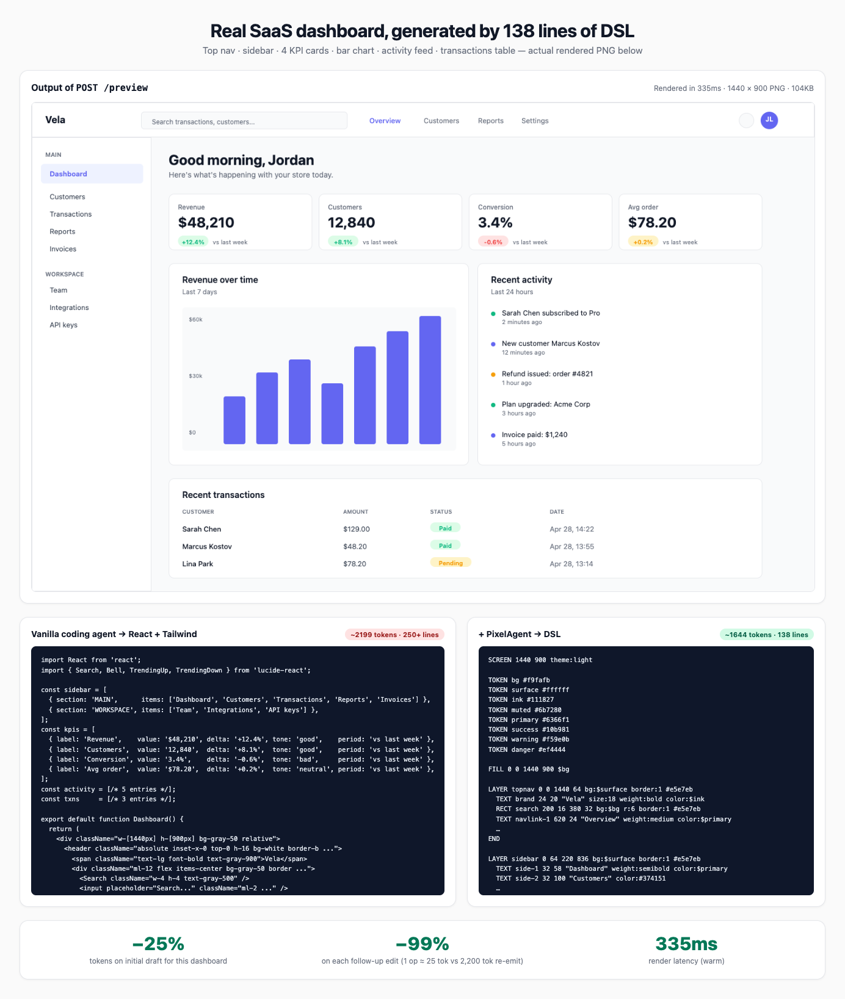
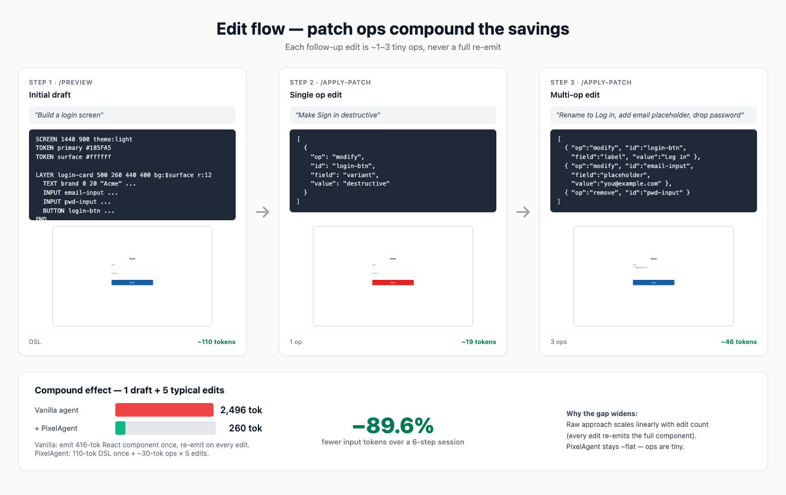
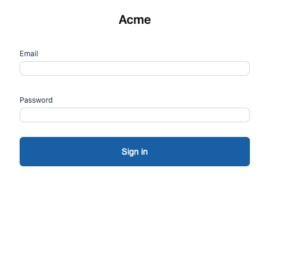
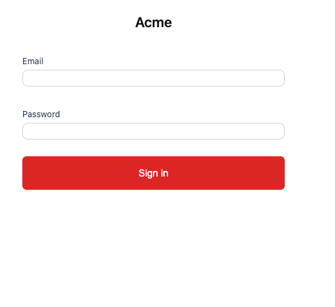
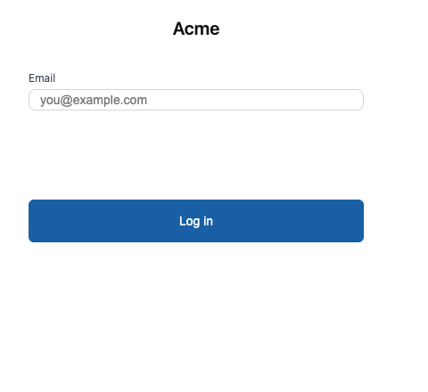

# PixelAgent

> **DSL preview middleware that cuts AI-coding-agent token cost by ~90% during UI iteration — and rises to −99% per follow-up edit.**

Coding agents (Claude Code, Cursor, Aider) burn tokens by emitting full
React/HTML for every preview *and* every edit. PixelAgent inserts a
typed DSL between the agent and the bitmap. Same Chrome engine renders
the preview, so visuals match what you'd ship — but the agent only
emits ~25-token patch ops per edit instead of re-generating the whole
component.

## Hero demo — a real SaaS dashboard

Top nav, sidebar, four KPI cards with trend deltas, bar chart, activity
feed, and a transactions table. The PNG below is the actual output of
`POST /preview` in this repo — 138 lines of DSL → headless Chrome →
PNG, end-to-end in ~335ms warm.



> The image above is a single-shot screenshot of the dashboard plus the
> side-by-side React vs DSL source the agent would emit. Click to view
> at full resolution.

### Why the gap matters

| Action on this dashboard | Vanilla coding agent | + PixelAgent | Saving |
|---|---|---|---|
| Initial render | ~2,200-token React + Tailwind component | ~1,650-token DSL | **−25%** |
| "Make the Conversion KPI green again" | re-emit full component, ~2,200 tokens | 1 patch op, ~25 tokens | **−99%** |
| "Swap the Avg-order card with a Returns metric" | re-emit, ~2,200 tokens | 3 patch ops, ~75 tokens | **−97%** |
| **6-step session (1 draft + 5 edits)** | **~13,200 tokens** | **~1,775 tokens** | **−87%** |
| Render latency | n/a (no preview) | 1.6s cold, ~330ms warm | — |

Initial-draft savings are modest on a complex layout (both formats
have to enumerate every element). The win compounds with every edit:
patch ops stay ~constant regardless of screen complexity, while
re-emitting a 2,200-token React component on each change scales
linearly.

## Smaller example — login screen, login flow

For a simpler screen the savings show up immediately even on the
initial draft, and edit-by-edit the gap is dramatic:



| | Vanilla coding agent | + PixelAgent | Saving |
|---|---|---|---|
| Initial draft (login) | React + Tailwind, ~416 tokens | DSL, ~110 tokens | **−74%** |
| Single follow-up edit ("make Sign in red") | re-emit, ~416 tokens | 1 op, ~19 tokens | **−95%** |
| Multi-edit (rename + placeholder + remove) | re-emit, ~416 tokens | 3 ops, ~46 tokens | **−89%** |
| **6-step session (1 draft + 5 edits)** | **~2,496 tokens** | **~260 tokens** | **−89.6%** |

### Pixel-stable across edits

| Initial draft | After 1 op (`variant: destructive`) | After 3 ops (rename, placeholder, drop password) |
|:---:|:---:|:---:|
|  |  |  |
| `~110 tokens DSL` | `~19 tokens (1 op)` | `~46 tokens (3 ops)` |

Every unchanged element keeps its exact pixel position — no drift, no
"the model rewrote the button radius from 6px to 8px again". That's
the hidden cost the token table doesn't capture.

---

## Try it locally

```bash
git clone git@github.com:junixlabs/PixelAgent.git
cd PixelAgent
npm install
npm run start --workspace=@pixelagent/api  # boots HTTP API on :3030
```

In another terminal, reproduce the demo above:

```bash
# Initial preview
curl -sX POST localhost:3030/preview \
  -H 'content-type: application/json' \
  -d "{\"dsl\":\"$(cat packages/dsl-spec/examples/login.dsl | jq -Rs . | sed 's/^"//;s/"$//')\"}" \
  | jq -r .png_base64 | base64 -d > preview.png

# 1-op edit — change Sign in variant to destructive
curl -sX POST localhost:3030/apply-patch \
  -H 'content-type: application/json' \
  -d '{"dsl":"...","ops":[{"op":"modify","id":"login-btn","field":"variant","value":"destructive"}]}' \
  | jq -r .png_base64 | base64 -d > patched.png
```

Or wire it into Claude Code as an MCP server (no API key needed) —
see [`docs/mcp-integration.md`](docs/mcp-integration.md).

## Status

- **Phase 1** — Parser, renderer, HTTP `/preview` + `/apply-patch` +
  `/synthesize`, MCP server (preview + apply_patch + synthesize tools,
  grammar resource). All tests passing, hardened against LLM-malformed
  input.
- **Phase 2** — Additional codegen targets (HTML standalone, SwiftUI),
  CLI binary, GitHub Actions CI.
- **Phase 3** — Vision-verify, pixel-trace bidirectional, multi-target
  output.

## Problem (the long version)

When Claude Code, Cursor, or any coding agent builds UI, three inefficiencies compound:

1. **Previews are expensive.** Showing a preview means emitting the full
   code first (~3,000 tokens, 25–40 seconds). If the user rejects, all
   that cost is wasted.
2. **Edits re-generate the full component.** "Make the button blue"
   triggers a 100% rewrite. Five edits = 5× the cost.
3. **Micro-detail drift.** The agent silently emits three buttons with
   different spacing, two cards with different border-radius. The human
   has to spot and flag each one.

---

## Solution Architecture

PixelAgent runs four stages between the coding agent and the user:

```
Coding agent (Claude/GPT)
       │
       ▼
┌──────────────────────────────────────────────┐
│  Stage 1: DSL Generation                     │
│  Agent emits DSL (~300 tokens)               │
│  instead of code (~3,000 tokens)             │
└──────────────────┬───────────────────────────┘
                   │
                   ▼
┌──────────────────────────────────────────────┐
│  Stage 2: Render Bitmap (zero LLM cost)      │
│  DSL → internal HTML/CSS → Headless Chrome   │
│  → PNG bitmap (~3 seconds cold, <100ms warm) │
└──────────────────┬───────────────────────────┘
                   │
                   ▼
┌──────────────────────────────────────────────┐
│  Stage 3: Preview & Feedback                 │
│  User sees PNG → Approve / Reject / Edit     │
└──────────────────┬───────────────────────────┘
                   │
              Edit feedback
                   ▼
┌──────────────────────────────────────────────┐
│  Stage 3.5: Surgical DSL Patch (the key)     │
│  Agent emits a patch op (~30 tokens)         │
│  { op: 'modify', id: 'login-btn',            │
│    field: 'bg', value: '#10B981' }           │
│  Applied locally, re-rendered. 100× cheaper  │
│  than re-generating the whole component.     │
└──────────────────┬───────────────────────────┘
                   │
              User approves
                   ▼
┌──────────────────────────────────────────────┐
│  Stage 4: Final Code Synthesis               │
│  DSL → React / HTML / SwiftUI                │
│  Runs ONCE at the end — not N times.         │
└──────────────────────────────────────────────┘
```

### DSL example

```
SCREEN 1440 900 theme:light

TOKEN primary #185FA5
TOKEN surface #ffffff
TOKEN radius 8

LAYER login-card 500 260 440 400 bg:$surface r:12
  TEXT brand 0 20 "Acme" size:20 weight:semibold align:center max-width:440
  INPUT email-input 32 80 376 44 type:email label:"Email"
  INPUT pwd-input 32 156 376 44 type:password label:"Password"
  BUTTON login-btn 32 224 376 48 "Sign in" variant:primary
END

STATE login-btn hover
  bg: #0C447C
END
```

Fifteen commands total: SCREEN, TOKEN, FILL, RECT, TEXT, ICON, IMAGE, INPUT, BUTTON, LAYER, STACK, GRID, STATE, REPEAT, EFFECT.

---

## Repository Structure

```
pixelagent/
├── README.md                      # This file
├── package.json
├── tsconfig.json
│
├── packages/
│   ├── dsl-spec/                  # DSL specification & docs
│   │   ├── SPEC.md                # Full DSL v0 specification
│   │   ├── examples/              # Reference DSL files
│   │   └── grammar.ts             # Type definitions
│   │
│   ├── parser/                    # DSL parser (TypeScript)
│   │   ├── src/
│   │   │   ├── tokenizer.ts
│   │   │   ├── parser.ts
│   │   │   ├── validator.ts
│   │   │   └── types.ts
│   │   └── tests/
│   │
│   ├── renderer/                  # DSL → bitmap renderer
│   │   ├── src/
│   │   │   ├── dsl-to-html.ts     # DSL → HTML/CSS internal
│   │   │   ├── render.ts          # Headless Chrome → PNG
│   │   │   └── id-buffer.ts       # Pixel→element trace
│   │   └── tests/
│   │
│   ├── api/                       # HTTP API server (Fastify)
│   │   ├── src/
│   │   │   ├── server.ts
│   │   │   ├── routes/
│   │   │   │   ├── preview.ts     # POST /preview
│   │   │   │   ├── apply-patch.ts # POST /apply-patch
│   │   │   │   └── synthesize.ts  # POST /synthesize
│   │   │   └── services/          # pure service fns shared with MCP
│   │   └── tests/
│   │
│   ├── mcp/                       # MCP stdio server
│   │   └── src/                   # tools: preview / apply_patch / synthesize
│   │
│   └── codegen/                   # DSL → React/HTML/SwiftUI
│       ├── src/
│       │   ├── react.ts
│       │   ├── html.ts
│       │   └── swiftui.ts
│       └── tests/
│
├── docs/                          # Public documentation
│   ├── getting-started.md
│   ├── dsl-reference.md
│   ├── mcp-integration.md
│   └── api-reference.md
│
└── examples/
    ├── claude-code-mcp/           # Demo MCP integration
    └── manual-cli/                # Demo CLI usage
```

---

## Implementation Roadmap

### Phase 1 — MVP core ✅ done

**Goal:** end-to-end flow runs against the reference screens.

- [x] **DSL parser** (`packages/parser`) — tokenizer, parser, validator,
  serializer, applyPatch with per-node-type field validation.
- [x] **Renderer** (`packages/renderer`) — DSL → HTML/CSS → headless
  Chrome → PNG. ~700ms cold, ~100ms warm. LAYER/STACK/GRID/REPEAT
  layout primitives.
- [x] **Preview API** — `POST /preview { dsl } → { png_base64, render_ms, warnings }`.
- [x] **Apply-patch API** — `POST /apply-patch { dsl, ops } → { png_base64, new_dsl, applied, warnings }`. No LLM call.
- [x] **Synthesize API** — `POST /synthesize { dsl, target: "react" } → { code, warnings }`. Deterministic AST → React + Tailwind.
- [x] **MCP server** — `pixelagent_preview`, `pixelagent_apply_patch`,
  and `pixelagent_synthesize` tools, plus `pixelagent://grammar`
  resource. No `ANTHROPIC_API_KEY` needed; the host's model generates
  the ops.

### Phase 2 — Production-ready (next)

- [ ] **Code synthesis** (`packages/codegen`)
  - DSL AST → React + Tailwind component
  - DSL AST → HTML/CSS standalone
  - Pixel-locked vs adaptive output mode
- [ ] **CLI binary** — `pixelagent preview / apply-patch / synthesize`.
- [ ] **Consistency validator**
  - Detect: spacing rhythm, TOKEN coverage, hover-state coverage
  - Output: warnings array with line numbers
- [ ] **CI pipeline** — GitHub Actions running typecheck + tests on PR
  and on push to `main`.
- [ ] **Tests + benchmarks**
  - Visual regression: render → screenshot → diff
  - Real token cost benchmark vs raw Claude Code (replace estimates)

### Phase 3 — Differentiation

- [ ] **Vision verify (optional)**
  - Post-render check via Claude vision
  - Detect alignment + color-drift errors
  - Cost-gated: opt-in only
- [ ] **Pixel-trace bidirectional**
  - ID buffer encodes element id in the alpha channel
  - Click pixel → return element id + DSL line
- [ ] **Multi-target output**
  - SwiftUI (native iOS)
  - Jetpack Compose (Android)

---

## API Reference (Phase 1)

### `POST /preview`

Render DSL to PNG.

**Request:**
```json
{
  "dsl": "SCREEN 1440 900 theme:light\n...",
  "scale": 1.0
}
```

**Response:**
```json
{
  "png_base64": "iVBORw0KGgoAAAANS...",
  "render_ms": 117,
  "warnings": [
    { "line": 12, "rule": "tap-target-min-height", "severity": "warning",
      "message": "INPUT min height is 36px" }
  ]
}
```

### `POST /apply-patch`

Apply pre-built patch ops to a DSL and re-render. **No LLM call** —
the caller (typically the host's coding agent) provides the ops. This
is the path the MCP server uses.

**Request:**
```json
{
  "dsl": "...existing DSL...",
  "ops": [
    { "op": "modify", "id": "login-btn", "field": "variant", "value": "destructive" }
  ]
}
```

**Response:**
```json
{
  "new_dsl": "...updated DSL...",
  "applied": [
    { "op": "modify", "id": "login-btn", "field": "variant", "value": "destructive" }
  ],
  "png_base64": "iVBORw0KGgoAAAANS...",
  "warnings": []
}
```

The server validates each op against the target node type's writable
fields (e.g. rejects `bg` on a `text` node, `weight: 'extra-bold'`,
malformed `border`). Failed ops are skipped and reported in `warnings`;
later ops still apply against the partially-updated scene.

### `POST /synthesize`

Generate final code from approved DSL. Stateless and LLM-free — the
codegen maps the AST deterministically.

**Request:**
```json
{
  "dsl": "...final approved DSL...",
  "target": "react"
}
```

**Response:**
```json
{
  "code": "export default function GeneratedScreen() { return (...); }",
  "warnings": []
}
```

---

## DSL Specification (v0)

### 15 commands by category

**Setup**
- `SCREEN <w> <h> [theme:light|dark]` — viewport, must be first line
- `TOKEN <id> <value>` — design tokens, referenced as `$id`

**Paint**
- `FILL <x> <y> <w> <h> <color>` — solid color region, no ID
- `RECT <id> <x> <y> <w> <h> [bg:] [r:] [border:]` — rectangle with ID
- `TEXT <id> <x> <y> "<string>" [size:] [weight:] [color:] [align:] [max-width:]`
- `ICON <id> <x> <y> "<name>" [size:] [color:]`
- `IMAGE <id> <x> <y> <w> <h> <src> [fit:] [r:]`

**Components**
- `INPUT <id> <x> <y> <w> <h> [type:] [placeholder:] [label:] [state:]`
- `BUTTON <id> <x> <y> <w> <h> "<label>" [variant:] [state:]`

**Layout (block commands, end with END)**
- `LAYER <id> <x> <y> <w> <h> [bg:] [r:] [border:]` — group container
- `STACK <id> <x> <y> [direction:] [gap:] [align:]` — auto-layout flex
- `GRID <id> <x> <y> <w> [columns:] [gap:]` — column-based grid

**Meta**
- `STATE <target-id> <state-name>` — visual state override
- `REPEAT <id> <count> [direction:] [gap:]` — template loop
- `EFFECT <target-id> <type> [params]` — shadow, blur, overlay

### Critical rules

1. `SCREEN` MUST be the first non-comment line, exactly once.
2. Children inside `STACK` must NOT have x/y coordinates (auto-positioned).
3. `RECT` is paint-only, never has children. Use `LAYER` for containers.
4. All elements (except FILL) need unique IDs.
5. Block commands (LAYER/STACK/GRID/REPEAT/STATE) end with `END`.
6. Border on LAYER/RECT uses inline param: `border:1 #ccc`. Don't use `EFFECT border` for inline borders.
7. TEXT with `align:center` should use `x:0` and `max-width:` to define centering box.
8. INPUT with `label:` requires `y >= 20` for label clearance.
9. BUTTON/INPUT minimum height: 36px (tap target).

---

## Technical Decisions

### Decision 1: Headless Chrome as render engine
**Choice:** Use Puppeteer/Playwright instead of custom renderer.
**Why:** Browser engine is battle-tested, pixel-perfect, free. Code output also targets browser → preview matches production. Custom renderer = 6 months wasted on font hinting and anti-aliasing.

### Decision 2: DSL as API contract
**Choice:** Treat DSL spec as a public, stable API contract.
**Why:** Once published, breaking changes break user code. Spend extra time on spec correctness and extensibility upfront.

### Decision 3: Edit on AST, not bitmap
**Choice:** All edits modify DSL AST and re-render. Pixel-level click only resolves to element ID, then edits AST.
**Why:** Single source of truth. Enables undo/redo and code generation. Pixel edits would lose semantic meaning.

### Decision 4: Open-source DSL, proprietary service
**Choice:** Open-source DSL spec + parser. Keep renderer/API as paid service.
**Why:** Open spec → developer trust + adoption. Service → revenue stream. Pattern proven by Cursor, Vercel, Cloudflare.

### Decision 5: MCP-first distribution
**Choice:** Wrap PixelAgent as MCP server, submit to Anthropic marketplace.
**Why:** Built-in distribution to Claude Code users. Cursor and other agents adopting MCP. Position as infrastructure, not product.

---

## Risks & Mitigations

| Risk | Severity | Mitigation |
|---|---|---|
| Anthropic/OpenAI build native DSL preview | High | Open-source spec, become standard before they do |
| Coding agents struggle to learn DSL | High | Test with Sonnet 4 from week 1. If <80% accuracy, redesign DSL |
| Renderer fidelity gap (preview ≠ code output) | Medium | Use same Chrome engine for both. Document ±2px tolerance |
| Pricing model unclear (who pays?) | Medium | Free tier + enterprise SLA. Pattern from Vercel/Cloudflare |
| Vision verify too expensive | Low | Make P2/optional. MVP doesn't depend on it |

---

## Validation Plan (14 days before full build)

Don't build full product yet. Validate problem first.

### Week 1: Measure & Listen

- [ ] **Day 1-3: Self-track.** Use Claude Code/Cursor to build 5 different UIs. Measure: tokens/screen, time/iteration, full re-gens triggered by single micro-edit. Get real data.
- [ ] **Day 4-5: Talk to devs.** 5-10 30-min interviews with active Claude Code/Cursor users. Ask: "What frustrates you most when AI builds UI?" Record exact wording.

### Week 2: Build & Signal

- [ ] **Day 6-8: Smallest demo.** DSL parser + Puppeteer renderer + 1 endpoint `/preview`. Just a login form. Test 5 different prompts.
- [ ] **Day 9-10: MCP prototype.** Wrap demo as MCP server. Test with Claude Code. Verify Claude can produce valid DSL.
- [ ] **Day 11-12: Public signal.** Tweet thread + HN post: "I'm building [problem] for Claude Code users. Here's the prototype. Anyone else struggle with this?"
- [ ] **Day 13-14: Decide.** Based on day 1-3 data, day 4-5 sentiment, day 11-12 signal → Continue full build, Pivot, or Drop.

---

## Pitch Statement

**Don't say:**
- "AI design tool" — competing with Lovable/v0/Framer (saturated market)
- "First to verify visually" — already done by research papers and Emergent.sh
- "Save tokens" — confusing without context

**Do say:**
- "Middleware that cuts Claude Code token cost by 85% during UI iteration"
- "DSL preview layer for AI coding agents — preview before code, patch instead of regen"
- "MCP server that gives Claude Code visual draft mode"

---

## Roadmap items not yet built

- **CLI binary** — `pixelagent preview / apply-patch / synthesize`. The
  HTTP API and MCP server expose the same primitives today; a CLI is
  Phase 2.
- **`@pixelagent/cli` npm package** — once the CLI lands, install with
  `npm install -g @pixelagent/cli`.
- **Codegen** — `POST /synthesize` is currently a stub returning 501.
  DSL → React/Tailwind / HTML / SwiftUI is Phase 2.

---

## License

MIT for the DSL spec, parser, and examples.
The renderer service and hosted API are under a separate commercial
license (TBD).

---

## Contributing

Phase 1 is complete and the architecture is settled. Issues and PRs
are welcome — see [`docs/GITFLOW.md`](docs/GITFLOW.md) for the
trunk-based-development workflow this repo follows.

---

## Resources

- **DSL spec:** [`packages/dsl-spec/SPEC.md`](packages/dsl-spec/SPEC.md)
- **MCP setup:** [`docs/mcp-integration.md`](docs/mcp-integration.md)
- **Git workflow:** [`docs/GITFLOW.md`](docs/GITFLOW.md)
- **Tech debt:** [`docs/tech-debt.md`](docs/tech-debt.md)
- **Examples:** [`packages/dsl-spec/examples/`](packages/dsl-spec/examples/)

---

**Maintainer:** [@junixlabs](https://github.com/junixlabs)
**Status:** Phase 1 complete. Phase 2 (codegen + CLI + CI) in flight.
